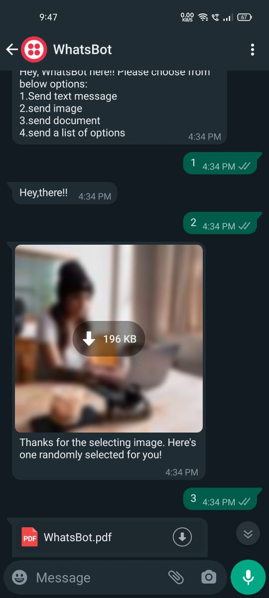

# whatsapp-bot
<h3>About this app?</h3>

So, this is an whatsapp bot which has basic functionality like, 1.send a text. 2.send an image. 3.send an document. 4.send your whatsapp name.

<h3>Creation & Technologies?</h3>

To create this I have us flask for serving webserver and https://twilio.com (we have to do basic setp for this) to make an basic bot number.Whenever an user send msg to bot number provided by twilio then an post request from twilio will be send to our weburl (note that to give callbackurl your url should have hosted ..localhost
will not be allowed .to tackle this problem I have used https://ngrok.com/download .)and then the responses,user_name ,msg_status I have stored in mongoDb as cloud database.To deal
with mongoDb you can use pymongo an python module. So,yeah this was an basic steps I have followed to create this

<h3>output</h3>

